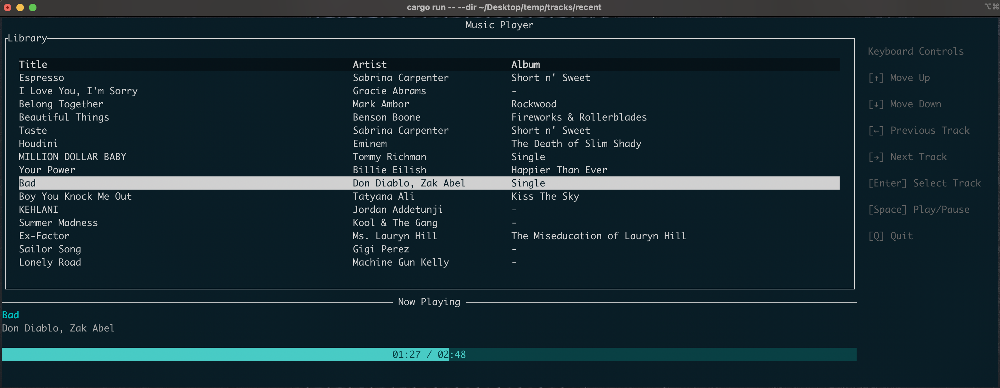

## Audio X (Terminal Music Player)



A terminal UI music player built with `Rust`and `Ratatui`library. The functionality of the app is quite basic at the moment, but I intend to add more features like **Shuffle**, **Repeat**, **Loop (A - B)** and much more. 

### Usage
```bash
cargo run -- --dir <SONG DIRECTORY>
```